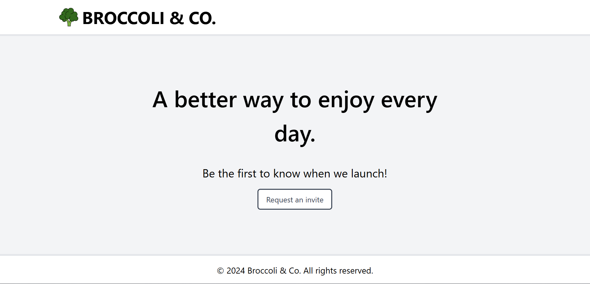

# Broccoli & Co

**Broccoli & Co** is a simple website that allows users to request an invitation to learn about an upcoming product release.

It is implemented in React with a modern styling approach, using the latest technologies supported by most browsers. It comes packaged with a complete set of unit tests and ready for production.



## Technologies Used

- **Vite**: Fast build tool and development server for modern web apps.
- **TypeScript**: A superset of JavaScript that adds static types for better tooling.
- **React**: A JavaScript library for building user interfaces.
- **Tailwind CSS**: Utility-first CSS framework for styling.
- **Vitest**: Fast test runner for Vite, used for unit and integration tests.
- **ESLint**: A tool for identifying and fixing code quality issues.
- **Prettier**: Code formatter to ensure consistent code style.

## Features

- User-friendly website to request invitations for an upcoming product release.
- Fully responsive UI using Tailwind CSS.
- Near 100% test coverage with Vitest.
- Simple ESLint and Prettier configuration for clean and consistent code.

## Getting Started

To get started with the project locally, follow these steps:

### Prerequisites

Make sure you have the following installed:

- [Node.js](https://nodejs.org) (v16 or above)
- [npm](https://www.npmjs.com/get-npm)

### Optional Tools

- [ESLint](vscode:extension/dbaeumer.vscode-eslint)
- [Prettier](vscode:extension/esbenp.prettier-vscode)

## Installation

1. Clone the repository:

   ```bash
   git clone https://github.com/tztzt/broccoli-co
   cd broccoli-co
   ```

2. Install dependencies
   ```bash
   npm install
   ```
3. Run the development server. (The browser page is conveniently opened directly at `localhost:5173`)

   ```bash
   npm run dev
   ```

## Running Tests

To run the tests:

```bash
npm run test
```

For a detailed test coverage:

```bash
npm run coverage
```

## Developer Experience

This project has also been enhanced with common ESLint and Prettier configurations and plugins to maintain a codebase of high quality and readability.

It is **strongly recommended** to install these tools in your Visual Studio Code

- add to your Visual Studio Code for automatically format on save according to prettier config

```json
"editor.formatOnSave": true,
```

The project is also packaged with [@trivago/prettier-plugin-sort-imports](https://github.com/trivago/prettier-plugin-sort-imports) and [prettier-plugin-packagejson](https://www.npmjs.com/package/prettier-plugin-packagejson) to conveniently manage file imports and organise package.json contents.
